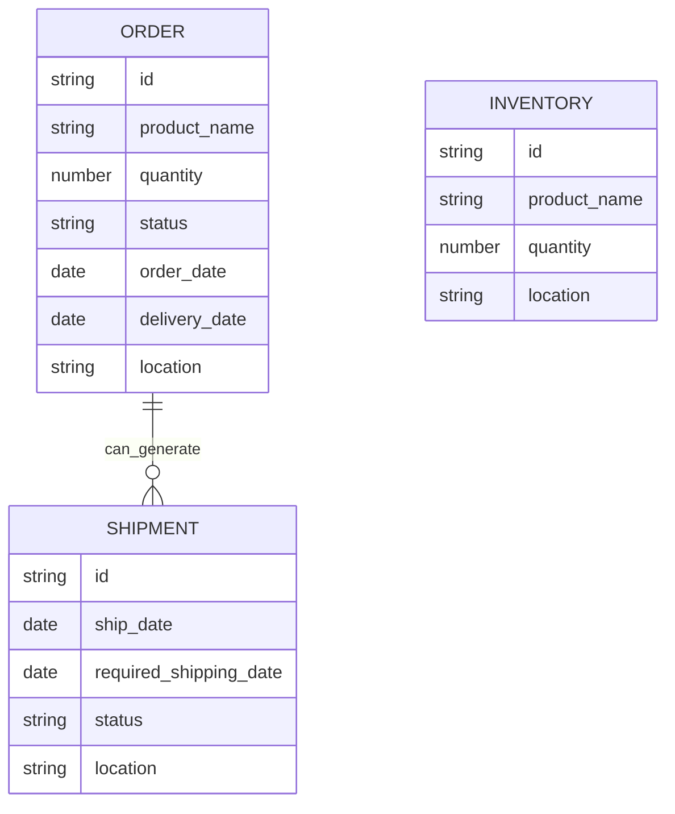
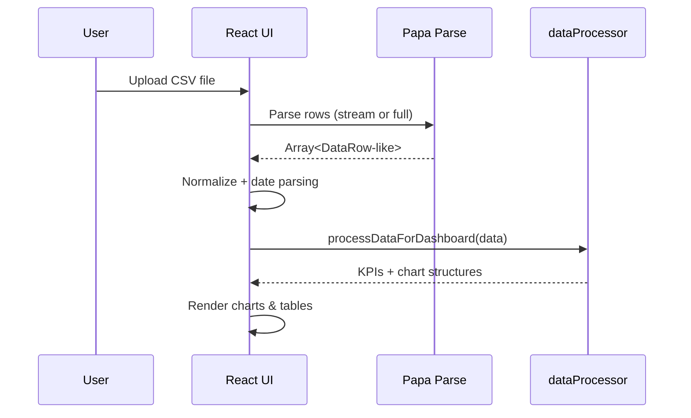
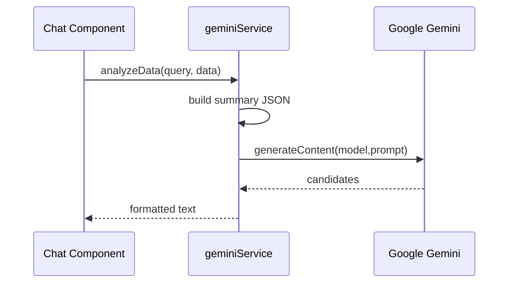
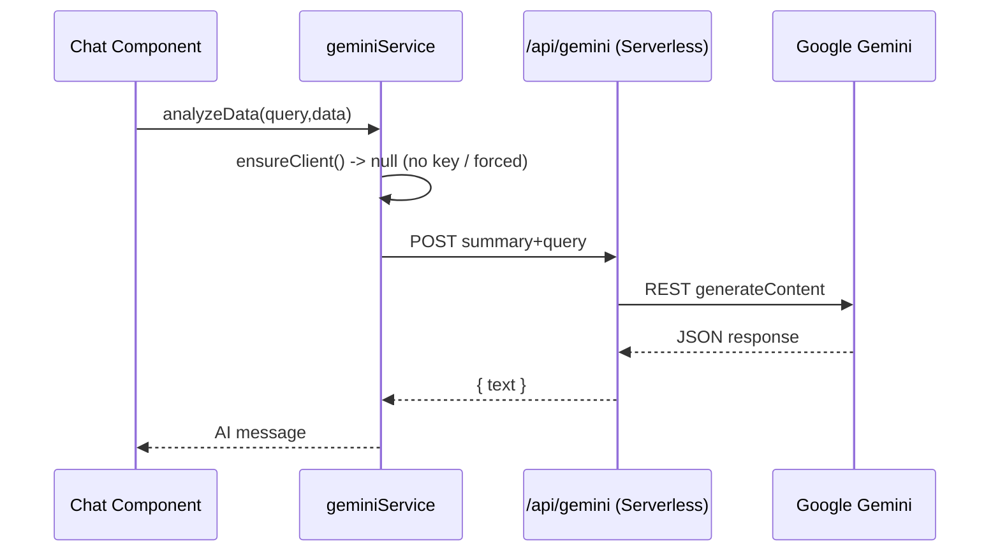
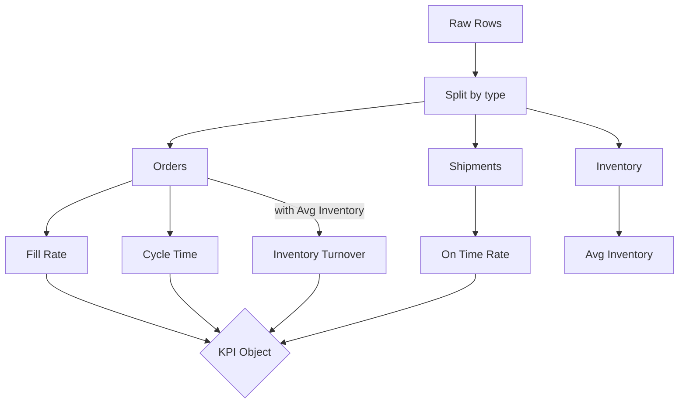

# FIQ Control Tower – Architectural Overview

## 1. Purpose & Vision

FIQ Control Tower is a data‑driven supply chain visibility and analytics web application. It ingests user‑provided CSV datasets (orders, shipments, inventory), computes operational KPIs, visualizes performance, and augments human analysis with an AI (Gemini) assistant that can summarize, interrogate, and extract insights from the processed data. The solution is currently **frontend‑centric** (React + Vite) with a thin **serverless proxy** for secure AI API access; there is **no persistent database** yet—data lives only in browser memory during a session.

Core value propositions:

- Rapid exploratory analytics without needing a full backend warehouse.
- Pluggable AI-driven narrative and diagnostic layer over structured operational data.
- Extensible foundation for future persistence, role-based access, and predictive modules.

---

## 2. High-Level Architecture

A lightweight SPA (React) orchestrates data ingestion, transformation, visualization, and AI requests. AI calls use either:

1. Direct in‑browser SDK (if a public key is made available) OR
2. A Vercel serverless function proxy (`/api/gemini`) to keep the key server-side.

```mermaid
flowchart LR
  subgraph Browser[Client (React/Vite SPA)]
    U[User] --> UI[UI Components]
    UI --> CSV[CSV Upload & Parse]
    CSV --> DP[dataProcessor.ts]\n(KPI & Chart Derivation)
    DP --> Dash[Dashboard Components]
    UI --> AIChat[FloatingAiChat / AiAnalyst]
    AIChat -->|prompts + summary| GeminiSvc[geminiService.ts]
  end

  subgraph Serverless[Vercel Edge/Serverless]
    Proxy[/api/gemini\n(Serverless Function)/]
  end

  GeminiSvc -->|if no client key or forced proxy| Proxy
  Proxy --> GEMINI[Google Gemini API]
  GeminiSvc -->|SDK direct (key present)| GEMINI
  GEMINI --> Proxy --> GeminiSvc --> AIChat
```

Key characteristics:

- **Stateless runtime**: Each page load is fresh; data must be re-uploaded.
- **Serverless isolation**: Only AI proxy requires server execution.
- **No vendor lock-in** beyond Vercel’s function pattern (portable to any Node serverless platform).

---

## 3. Component Breakdown

### 3.1 Frontend (React + Vite + TypeScript)

- `components/`
  - `FloatingAiChat.tsx`: Advanced modal AI assistant with dataset summarization + rich prompt scaffolding.
  - `AiAnalyst.tsx`: Simpler chat interface focused on conversational Q&A using a sampled CSV slice.
  - `DashboardChart.tsx`, `KpiCard.tsx`, `OrdersTable.tsx`, `ProactiveAlerts.tsx`: Visualization & domain widgets (KPI surfacing, trend intent, risk hints).
  - Icons (`icons/`): SVG/TSX icon components and load spinner.
- `services/geminiService.ts`: Abstraction for AI access (direct SDK + proxy fallback + analytics prompt composition support).
- `utils/dataProcessor.ts`: Deterministic transforms & KPI engines over in-memory rows.
- `types.ts`: Canonical data contracts (DataRow, KPI types, chart data shape).
- Styling: Tailwind CSS build pipeline (utility-first), plus custom design token classes.

### 3.2 Serverless Backend

- `api/gemini.ts`: Node (Vercel) function performing secure Gemini REST calls. Adds model fallback, structured error responses.

### 3.3 External Integrations

- **Gemini (@google/genai / REST)**: Large Language Model for insight generation.
- **Papa Parse**: CSV ingestion & lightweight transformation support.
- **Recharts**: Chart rendering library for aggregated metrics.

### 3.4 (Future / Not Yet Implemented)

- Persistence layer (PostgreSQL / warehouse) for multi-session continuity.
- Authentication & user tenancy boundaries.
- Event streaming or near real-time telemetry ingestion.

---

## 4. Runtime Deployment Context

- **Hosting**: Vercel (Static + Serverless Functions).
- **Build Tool**: Vite (fast dev + optimized production bundle with code splitting potential).
- **Environment Variables**:
  - `GEMINI_API_KEY` (server-only)
  - `VITE_GEMINI_API_KEY` (exposed to client if used)
  - `VITE_GEMINI_USE_PROXY` (feature flag to force proxy usage)

---

## 5. Data Model Definitions

(Transient, in-memory only; shaped after CSV ingestion.)

### 5.1 Core Row Type

```ts
interface DataRow {
  type: 'order' | 'shipment' | 'inventory' | string;
  id: string;
  product_name: string;
  quantity: number;
  status: string;
  order_date: Date | null;
  ship_date: Date | null;
  delivery_date: Date | null;
  required_shipping_date: Date | null;
  location: string;
  [key: string]: any; // Flexible extension for heterogeneous CSV columns
}
```

### 5.2 KPI Aggregate Output

```ts
interface KpiData {
  fillRate: number;              // % of orders shipped/delivered
  cycleTime: number | 'N/A';     // Average days from order to delivery
  onTimeRate: number;            // % shipments shipped by required date
  inventoryTurnover: number;     // (Total shipped qty) / (avg inventory)
}
```

### 5.3 Chart-Derived Structures
### 5.3 Chart-Derived Structures

- `ordersChartData`: `{ name: status, value: count }[]`
- `inventoryChartData`: `{ name: location, quantity: totalQty }[]`
- `volumeChartData`: `{ name: date(ISO), orders: count }[]`

### 5.4 AI Summary Construction Fields (Dynamic)
### 5.4 AI Summary Construction Fields (Dynamic)

Gemini prompt packaging includes a synthesized `summary` object:

```ts

### 5.5 Entity Relationship (Conceptual)

```mermaid
{
  recordCount: number;
### 6.1 Data Ingestion & Processing

```mermaid
  types: Record<string, number>; // counts per type
### 6.2 AI Insight Request (Direct SDK Path)

```mermaid
  statusDistribution: Record<string, number>;
### 6.3 AI Insight Request (Proxy Fallback / Forced)

```mermaid
  locationCounts: Record<string, number>;
### 6.4 KPI Calculation Logic (Simplified)

```mermaid
  onTimeDeliveryRateFromDelivered: number | null;
## 7. geminiService Decision Logic

```mermaid
    delayed: number;
    cancelled: number;
    backordered: number;
    potentialRiskRate: number; // %
  };
  sampleRecords: Record<string, any[]>; // truncated exemplars per type
}
```

### 5.5 Entity Relationship (Conceptual)


(Actual system keeps all as rows keyed by `type`; this ERD exposes logical domain interpretation.)

## 6. Core Workflows

### 6.1 Data Ingestion & Processing



### 6.2 AI Insight Request (Direct SDK Path)



### 6.3 AI Insight Request (Proxy Fallback / Forced)



### 6.4 KPI Calculation Logic (Simplified)



---
## 7. geminiService Decision Logic
```mermaid
flowchart LR
  subgraph Service
    R[resolveApiKey()] -->|found & not forced| DC[Init SDK Client]
    R -->|missing OR forced| PX[Use /api/gemini]
  end
  Flag[VITE_GEMINI_USE_PROXY=true?] -->|yes| PX
  DC --> MODE{Call Path}
  PX --> MODE
```

---
## 8. Technology Stack Summary
| Layer | Technology | Notes |
|-------|------------|-------|
| Frontend Framework | React 19 | SPA with modern features (transitional elements etc.) |
| Build Tool | Vite 6 | Fast dev + tree-shaking bundler |
| Language | TypeScript | Strong typing for reliability |
| Styling | Tailwind CSS + custom tokens | Utility-first / rapid iteration |
| Charts | Recharts | Declarative chart primitives |
| CSV Parsing | Papa Parse | Handles large CSV gracefully |
| AI Client | @google/genai SDK + REST | Dual path for flexibility |
| Serverless Runtime | Vercel Functions | Minimal backend surface |
| Auth | (Not yet) | Future: JWT/Edge Middleware |
| Persistence | (None) | Future: Postgres / Warehouse / S3 staging |

---
## 9. Non-Functional Considerations
- **Security**: Proxy prevents client key exposure; direct path still optional for simplicity.
- **Performance**: Bundle currently large (~835 kB). Opportunities: dynamic imports (AI chat, charts), code splitting, removing unused polyfills.
- **Scalability**: Stateless front end scales via CDN; serverless proxy scales per invocation.
- **Resilience**: Fallback chain (primary model → alternate model). Need circuit breaker & retry for production maturity.
- **Observability**: Minimal console logging—future: structured logs & tracing (OpenTelemetry) in proxy.

---
## 10. Extension Roadmap
| Priority | Feature | Rationale |
|----------|---------|-----------|
| High | Persistent session store | Multi-visit continuity, collaboration |
| High | Auth + RBAC | Secure multi-tenant usage |
| Medium | Caching layer for AI summaries | Reduce cost & latency |
| Medium | Data validation & schema inference | Guardrail for bad CSVs |
| Medium | WebSocket/streaming AI responses | Progressive rendering UX |
| Low | Predictive ETA / risk scoring model | Advanced analytics value-add |

---
## 11. Risks & Mitigations
| Risk | Impact | Mitigation |
|------|--------|------------|
| Exposed API key (if client injected) | Abuse / cost | Use proxy + remove client key envs |
| Large bundle | Slower first paint | Code split; lazy load AI/chat modules |
| CSV quality variance | Incorrect KPIs | Add schema profiling + rejection rules |
| AI hallucination | Misleading insights | Constrain prompts, add factuality disclaimers |
| Rate limits (Gemini) | Failed queries | Implement caching / exponential backoff |

---
## 12. Open Questions
1. Should AI responses be persisted for audit/compliance? (Regulated supply chains often require traceability.)
2. Will multi-user simultaneous datasets be supported (necessitating multi-tenant segregation)?
3. Do we need streaming partial AI responses for long-running analyses?
4. Should we introduce domain-specific ontologies (SKUs, lanes, nodes) for semantic enrichment before AI prompting?

---
## 13. Summary
The current system is a lean, frontend-heavy analytical workspace with an AI augmentation layer. Its architecture optimizes for speed of iteration and minimal backend overhead, while leaving clear expansion seams for persistence, security, and scale. The dual-mode AI access pattern (direct vs proxy) offers operational flexibility during early-stage development while enabling a secure path for production hardening.

---
*End of document.*
